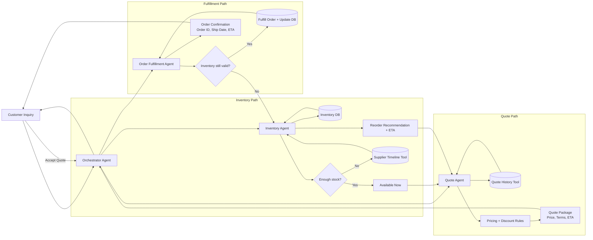

# Multi-Agent Workflow Diagram

This updated flowchart shows how a customer inquiry moves through orchestrated agents for inventory checks, quote generation, and order fulfillment.

## Sequence Notes

1. **Orchestrator Agent** receives the customer request and delegates to specialist agents.
2. **Inventory Agent** validates stock and checks supplier timing when inventory is low.
3. **Quote Agent** combines inventory outcomes with pricing history to produce quote options.
4. **Order Fulfillment Agent** re-validates inventory before committing the order and updating systems.
5. **Tools** provide controlled access to data stores and external services.
