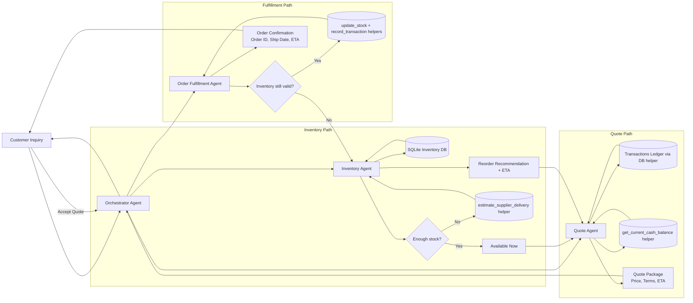

# Multi-Agent Workflow Diagram

This flowchart reflects the implemented Step 4 agent orchestration in `multi_agent_system.py`.

## Implementation Notes (Step 4)

- The orchestrator is implemented as `OrchestratorAgent` and manages control/data flow.
- Worker agents are implemented as:
  - `InventoryAgent`
  - `QuoteAgent`
  - `OrderFulfillmentAgent`
- Tooling is wired directly to starter helpers in `project_starter.py`:
  - `init_db`
  - `get_stock` / `update_stock`
  - `record_transaction`
  - `estimate_supplier_delivery`
  - `get_current_cash_balance`
- The low-stock branch produces an ETA and returns a quote with replenishment timing.
- The fulfillment branch revalidates stock before committing inventory and ledger writes.
